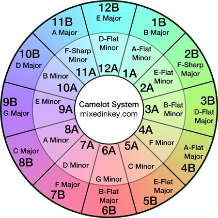
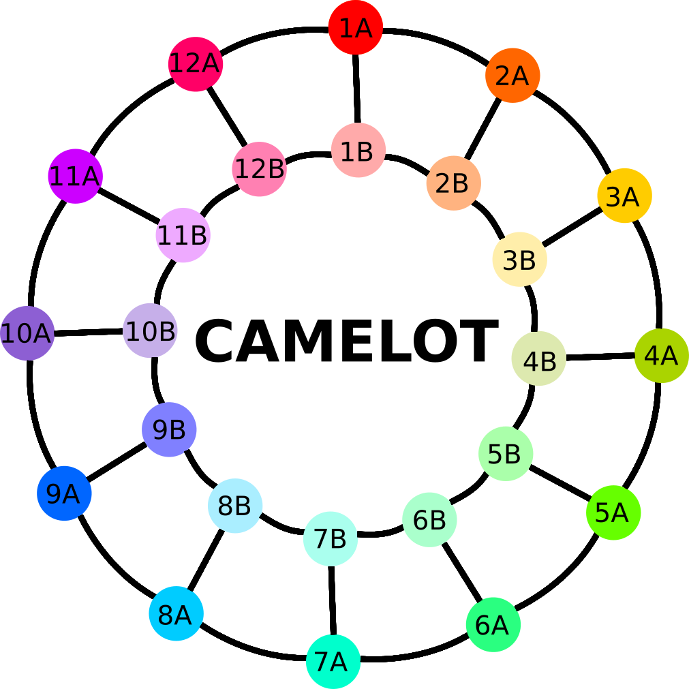
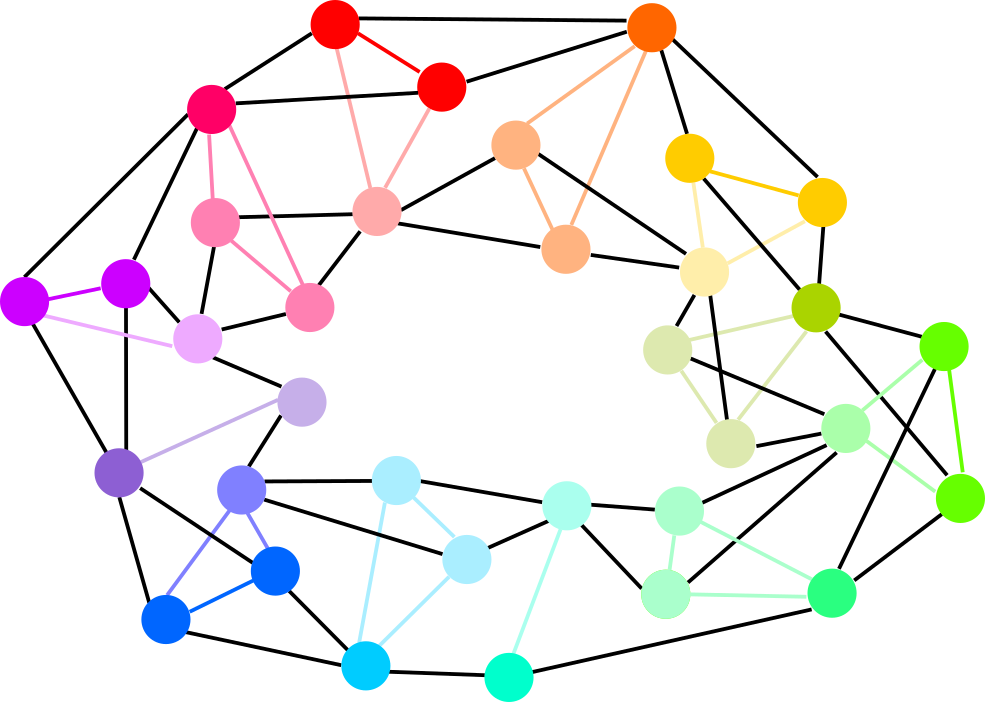
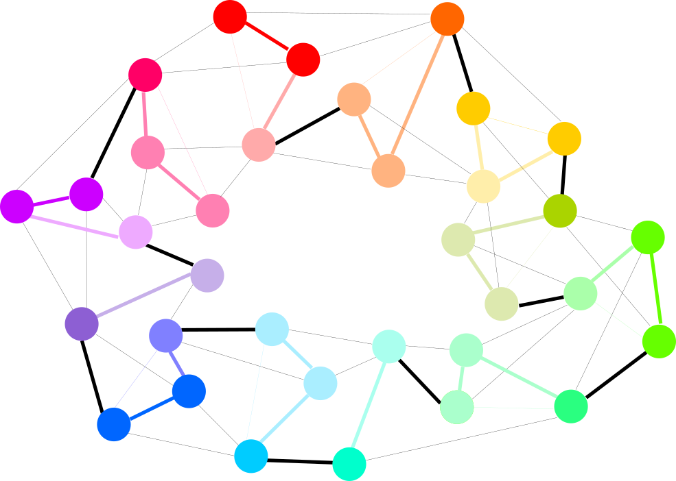
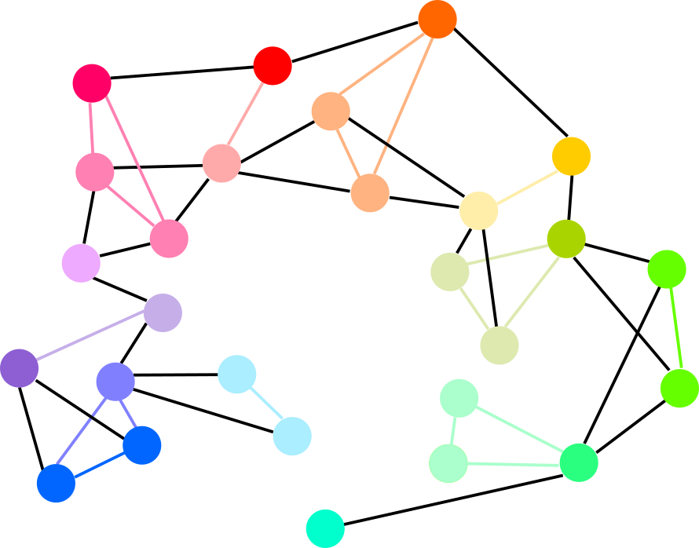
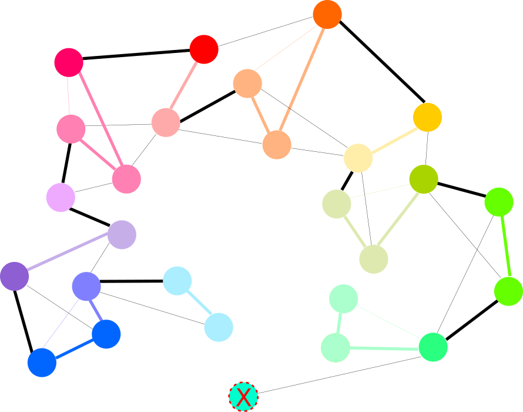

# Harmonic Track List Generator

Harmonic track list maker based on the Camelot key system.

## The Problem

To understand the objective of this program, and why we do it, we need to understand
what the Camelot Key System is and why we care about it.

### Camelot Key System

This system is just a transformation from classic musical keys to a simpler format;
with the sole purpose of facilitating harmonic track mixing. The following diagram
shows how each of the classic keys is assigned to a Camelot key:

The idea behind this system is that any track with a given key will be harmonic with
any other track that either shares it's key or has a neighbour key. For example,
if we had Track A with key 1A, then Track B would be harmonic with it if it had keys 
1B, 12A or 2A.

### Interpreting the system as a graph

Having explained the idea behind the system we can now translate it to a non directed
graph, were each edge means that we could mix tracks from nodes A to B harmonically.
Said graph would be (sorry for the color inconsistency and A->B order replacement):

### Track list graph example

Now, if we wanted to do the same as before but connecting those tracks that could be
mixed harmonically, then we would have something like this:

Having seen this, our objective should be to create a track list that included all of
our tracks (once) with harmonic transitions. Basically, we need to find a path in our
graph that includes every node and has no loops. Something like this:

 

Of course, this is one of the many possible results, as our example had a very well
connected graph.

### Few track graph example

In this other (suspiciously similar) example:

We can see there are a lot less nodes, and therefore less edges; which inevitably
brings less options in the creation of our track list. Particularly, we can see that
it is not possible to create a list with ALL of our tracks without loops; the best
we could do is leave one out, resulting in this:

Of course, if we wanted to add the song we left out really badly, we could just
eliminate it's other two light green cousins and add it. Two for one swap.